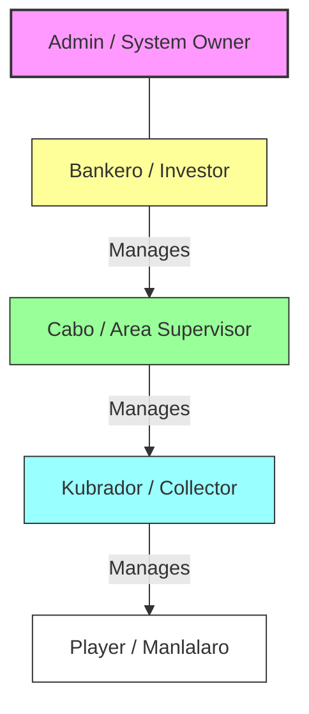
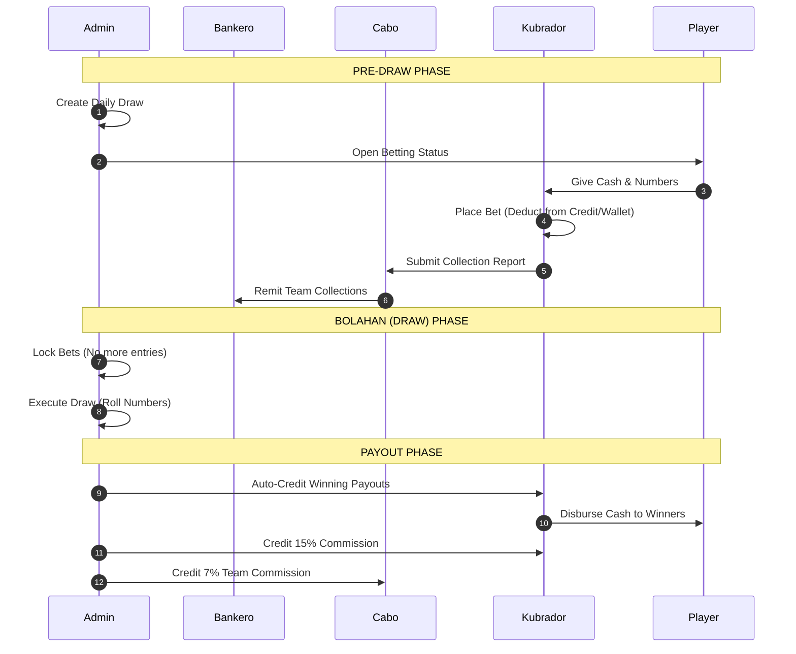
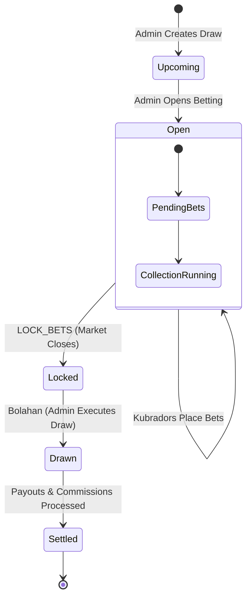
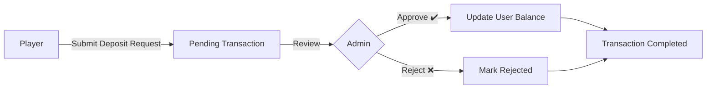
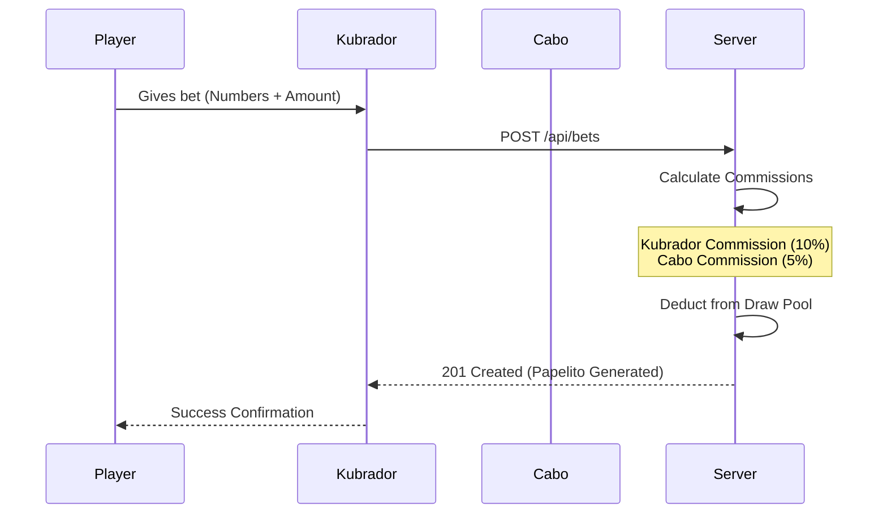
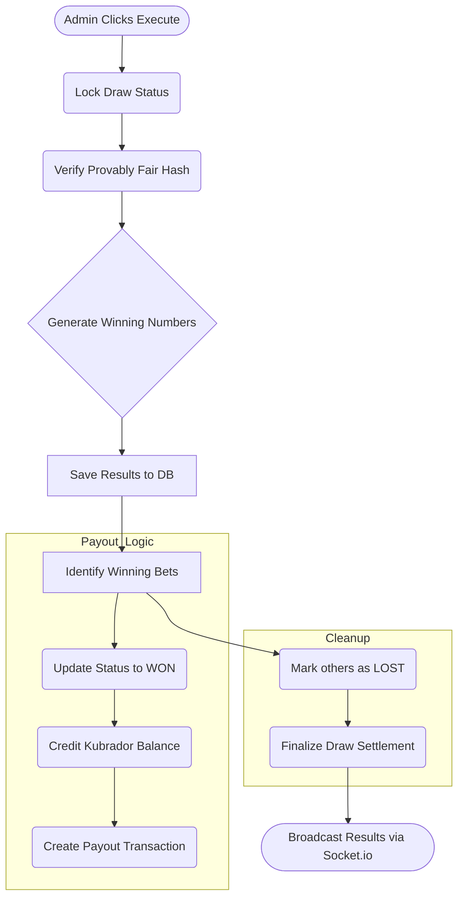

# Jueteng Platform Flowcharts

This document outlines the core logic and organizational structure of the Jueteng platform.

## 1. User Role Hierarchy & Reporting
The platform follows a strict reporting structure to ensure accountability in collections and commissions.

---

## 2. Role Responsibilities (Swimlane View)
How different users interact during the daily draw cycle.

---

## 2. Betting Life Cycle
Process for managing a daily draw from creation to actual payout.

---

## 3. Deposit & Approval Flow
How players add funds to their wallet for betting.

---

## 4. Betting & Commission Flow
Logic for placing a bet and calculating earnings.

---

## 5. Draw Execution (Bolahan)
Technical process when a winner is drawn.

